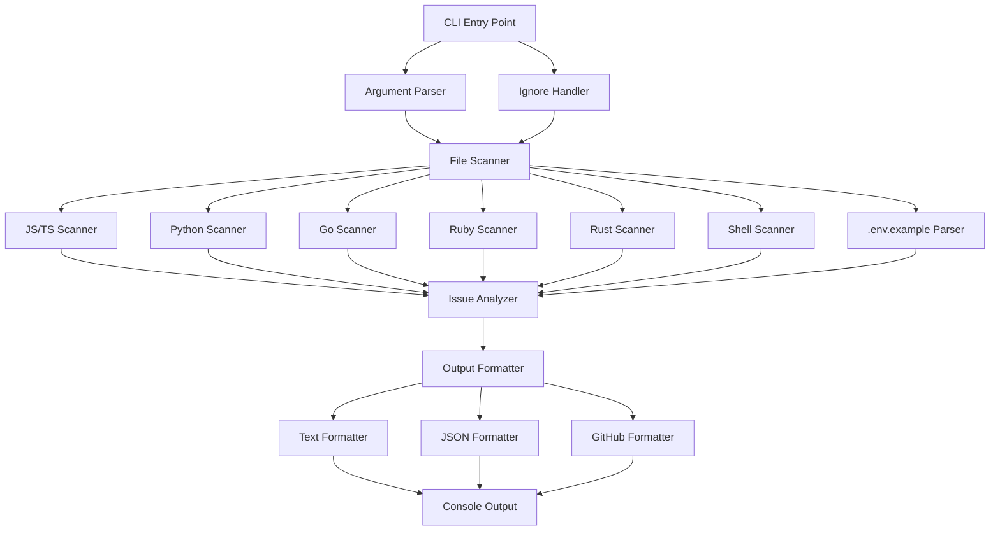
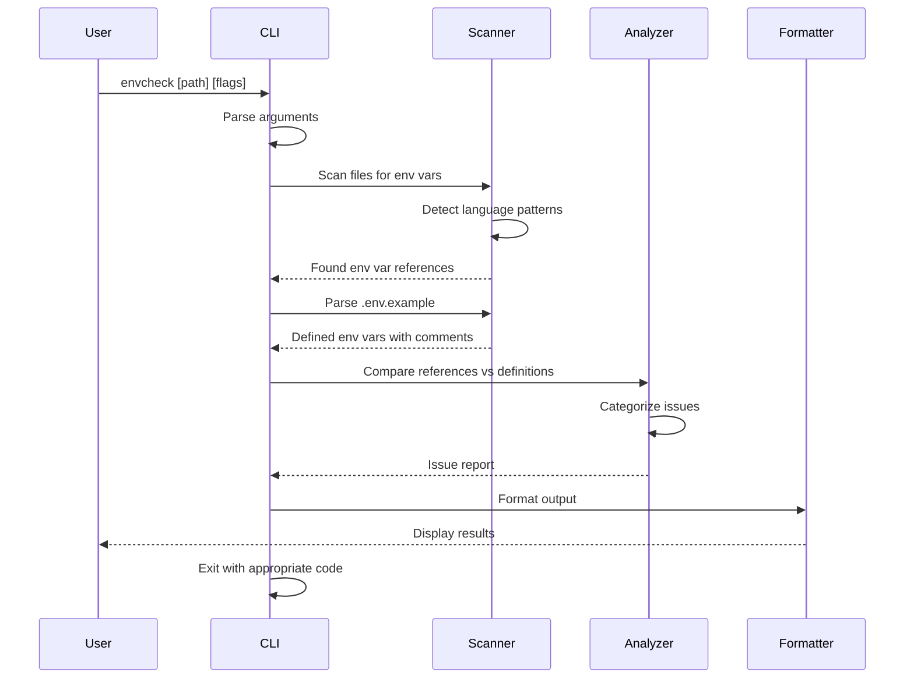

# Design Document: envcheck-cli

## Overview

envcheck is a production-ready, zero-dependency CLI tool that validates environment variable usage across a codebase. It scans source files to detect environment variable references, compares them against a `.env.example` file, and reports three categories of issues: MISSING (used in code but absent from .env.example), UNUSED (defined in .env.example but never referenced), and UNDOCUMENTED (used in both but lacking inline comments). The tool supports multiple languages (JavaScript/TypeScript, Python, Go, Ruby, Rust, Shell/Bash) through regex-based pattern matching, provides multiple output formats (text, JSON, GitHub Actions annotations), and is designed for CI/CD integration with configurable failure conditions.

## Architecture



## Sequence Diagrams

### Main Execution Flow




## Components and Interfaces

### Component 1: CLI Entry Point

**Purpose**: Parse command-line arguments, orchestrate the scanning and analysis workflow, and handle exit codes.

**Interface**:
```typescript
interface CLIOptions {
  path: string
  envFile: string
  format: 'text' | 'json' | 'github'
  failOn: 'missing' | 'unused' | 'undocumented' | 'all' | 'none'
  ignore: string[]
  noColor: boolean
  quiet: boolean
  version: boolean
  help: boolean
}

interface CLIRunner {
  run(args: string[]): Promise<number>
  parseArguments(args: string[]): CLIOptions
  displayHelp(): void
  displayVersion(): void
}
```

**Responsibilities**:
- Parse and validate command-line arguments
- Coordinate scanner, analyzer, and formatter components
- Determine exit code based on findings and --fail-on flag
- Handle errors gracefully with user-friendly messages

### Component 2: File Scanner

**Purpose**: Recursively traverse directories, identify relevant source files, and extract environment variable references.

**Interface**:
```typescript
interface FileScanner {
  scanDirectory(path: string, ignore: string[]): Promise<EnvVarReference[]>
  scanFile(filePath: string): Promise<EnvVarReference[]>
  shouldIgnoreFile(filePath: string, ignorePatterns: string[]): boolean
}

interface EnvVarReference {
  varName: string
  filePath: string
  lineNumber: number
  pattern: string
}
```

**Responsibilities**:
- Recursively walk directory tree
- Apply ignore patterns (.gitignore-style)
- Delegate to language-specific scanners based on file extension
- Aggregate all environment variable references


### Component 3: Language Scanners

**Purpose**: Detect environment variable references using language-specific regex patterns.

**Interface**:
```typescript
interface LanguageScanner {
  scan(content: string, filePath: string): EnvVarReference[]
  getPatterns(): RegExp[]
  getSupportedExtensions(): string[]
}

interface JavaScriptScanner extends LanguageScanner {
  // Patterns: process.env.VAR_NAME, process.env['VAR_NAME'], import.meta.env.VAR_NAME
}

interface PythonScanner extends LanguageScanner {
  // Patterns: os.environ['VAR_NAME'], os.environ.get('VAR_NAME'), os.getenv('VAR_NAME')
}

interface GoScanner extends LanguageScanner {
  // Patterns: os.Getenv("VAR_NAME"), os.LookupEnv("VAR_NAME")
}

interface RubyScanner extends LanguageScanner {
  // Patterns: ENV['VAR_NAME'], ENV.fetch('VAR_NAME')
}

interface RustScanner extends LanguageScanner {
  // Patterns: env::var("VAR_NAME"), std::env::var("VAR_NAME")
}

interface ShellScanner extends LanguageScanner {
  // Patterns: $VAR_NAME, ${VAR_NAME}, "$VAR_NAME"
}
```

**Responsibilities**:
- Define language-specific regex patterns for env var detection
- Extract variable names from matched patterns
- Track line numbers for reporting
- Handle edge cases (string interpolation, comments, etc.)

### Component 4: .env.example Parser

**Purpose**: Parse .env.example file to extract defined variables and their inline comments.

**Interface**:
```typescript
interface EnvFileParser {
  parse(filePath: string): Promise<EnvVarDefinition[]>
  extractComment(line: string): string | null
  isValidEnvLine(line: string): boolean
}

interface EnvVarDefinition {
  varName: string
  hasComment: boolean
  comment: string | null
  lineNumber: number
}
```

**Responsibilities**:
- Read and parse .env.example file
- Extract variable names (left side of =)
- Detect inline comments (# comment)
- Handle multi-line values and edge cases
- Validate .env file format


### Component 5: Issue Analyzer

**Purpose**: Compare environment variable references against definitions and categorize issues.

**Interface**:
```typescript
interface IssueAnalyzer {
  analyze(references: EnvVarReference[], definitions: EnvVarDefinition[]): AnalysisResult
  findMissing(references: EnvVarReference[], definitions: EnvVarDefinition[]): MissingIssue[]
  findUnused(references: EnvVarReference[], definitions: EnvVarDefinition[]): UnusedIssue[]
  findUndocumented(references: EnvVarReference[], definitions: EnvVarDefinition[]): UndocumentedIssue[]
}

interface AnalysisResult {
  missing: MissingIssue[]
  unused: UnusedIssue[]
  undocumented: UndocumentedIssue[]
  summary: IssueSummary
}

interface MissingIssue {
  varName: string
  references: EnvVarReference[]
}

interface UnusedIssue {
  varName: string
  definition: EnvVarDefinition
}

interface UndocumentedIssue {
  varName: string
  references: EnvVarReference[]
  definition: EnvVarDefinition
}

interface IssueSummary {
  totalMissing: number
  totalUnused: number
  totalUndocumented: number
  totalReferences: number
  totalDefinitions: number
}
```

**Responsibilities**:
- Identify variables used in code but missing from .env.example
- Identify variables defined in .env.example but never used
- Identify variables used and defined but lacking comments
- Generate summary statistics
- Deduplicate variable references

### Component 6: Output Formatter

**Purpose**: Format analysis results for different output targets (text, JSON, GitHub Actions).

**Interface**:
```typescript
interface OutputFormatter {
  format(result: AnalysisResult, options: FormatOptions): string
}

interface TextFormatter extends OutputFormatter {
  formatWithColors(result: AnalysisResult): string
  formatWithoutColors(result: AnalysisResult): string
}

interface JSONFormatter extends OutputFormatter {
  formatJSON(result: AnalysisResult): string
}

interface GitHubFormatter extends OutputFormatter {
  formatAnnotations(result: AnalysisResult): string
}

interface FormatOptions {
  noColor: boolean
  quiet: boolean
}
```

**Responsibilities**:
- Format text output with colors and emojis (🔴 🟡 🟢)
- Generate machine-readable JSON output
- Generate GitHub Actions annotations (::error, ::warning)
- Handle --no-color and --quiet flags
- Display summary statistics


### Component 7: Ignore Handler

**Purpose**: Process ignore patterns and determine which files should be excluded from scanning.

**Interface**:
```typescript
interface IgnoreHandler {
  loadIgnorePatterns(basePath: string): string[]
  shouldIgnore(filePath: string, patterns: string[]): boolean
  parseGitignore(filePath: string): string[]
  getDefaultIgnores(): string[]
}
```

**Responsibilities**:
- Load .gitignore patterns
- Load .envcheckignore patterns (if exists)
- Apply default ignore patterns (node_modules, .git, dist, build)
- Match file paths against glob patterns
- Support negation patterns (!pattern)

## Data Models

### Model 1: EnvVarReference

```typescript
interface EnvVarReference {
  varName: string        // The environment variable name (e.g., "DATABASE_URL")
  filePath: string       // Relative path to the file containing the reference
  lineNumber: number     // Line number where the reference appears
  pattern: string        // The actual matched pattern (e.g., "process.env.DATABASE_URL")
}
```

**Validation Rules**:
- varName must be non-empty string
- varName should match typical env var naming (uppercase, underscores)
- filePath must be valid relative path
- lineNumber must be positive integer

### Model 2: EnvVarDefinition

```typescript
interface EnvVarDefinition {
  varName: string        // The environment variable name
  hasComment: boolean    // Whether an inline comment exists
  comment: string | null // The comment text (without # prefix)
  lineNumber: number     // Line number in .env.example
}
```

**Validation Rules**:
- varName must be non-empty string
- If hasComment is true, comment must be non-null
- If hasComment is false, comment should be null
- lineNumber must be positive integer

### Model 3: AnalysisResult

```typescript
interface AnalysisResult {
  missing: MissingIssue[]           // Variables used but not defined
  unused: UnusedIssue[]             // Variables defined but not used
  undocumented: UndocumentedIssue[] // Variables used and defined but no comment
  summary: IssueSummary             // Aggregate statistics
}
```

**Validation Rules**:
- All arrays must be non-null (can be empty)
- summary must contain valid counts
- No duplicate variable names within each category


### Model 4: CLIOptions

```typescript
interface CLIOptions {
  path: string                                    // Directory or file to scan
  envFile: string                                 // Path to .env.example file
  format: 'text' | 'json' | 'github'             // Output format
  failOn: 'missing' | 'unused' | 'undocumented' | 'all' | 'none'  // Exit code condition
  ignore: string[]                                // Additional ignore patterns
  noColor: boolean                                // Disable colored output
  quiet: boolean                                  // Suppress non-error output
  version: boolean                                // Show version
  help: boolean                                   // Show help
}
```

**Validation Rules**:
- path must exist and be readable
- envFile must exist and be readable
- format must be one of: text, json, github
- failOn must be one of: missing, unused, undocumented, all, none
- ignore patterns must be valid glob patterns

## Algorithmic Pseudocode

### Main Processing Algorithm

```javascript
async function main(args) {
  // INPUT: Command-line arguments array
  // OUTPUT: Exit code (0 = success, 1 = validation failed, 2 = error)
  
  try {
    // Step 1: Parse command-line arguments
    const options = parseArguments(args)
    
    // Handle special flags
    if (options.help) {
      displayHelp()
      return 0
    }
    
    if (options.version) {
      displayVersion()
      return 0
    }
    
    // Step 2: Load ignore patterns
    const ignorePatterns = loadIgnorePatterns(options.path, options.ignore)
    
    // Step 3: Scan codebase for environment variable references
    const references = await scanDirectory(options.path, ignorePatterns)
    
    // Step 4: Parse .env.example file
    const definitions = await parseEnvFile(options.envFile)
    
    // Step 5: Analyze and categorize issues
    const result = analyzeIssues(references, definitions)
    
    // Step 6: Format and display output
    const output = formatOutput(result, options)
    console.log(output)
    
    // Step 7: Determine exit code based on --fail-on flag
    const exitCode = determineExitCode(result, options.failOn)
    
    return exitCode
    
  } catch (error) {
    console.error(`Error: ${error.message}`)
    return 2
  }
}
```

**Preconditions:**
- args is a valid array of strings
- Node.js runtime is available with fs, path, and util modules

**Postconditions:**
- Returns exit code 0, 1, or 2
- Output is written to stdout or stderr
- No unhandled exceptions escape

**Loop Invariants:** N/A (no loops in main function)


### File Scanning Algorithm

```javascript
async function scanDirectory(dirPath, ignorePatterns) {
  // INPUT: dirPath (string), ignorePatterns (array of glob patterns)
  // OUTPUT: Array of EnvVarReference objects
  
  const references = []
  const queue = [dirPath]
  
  // Breadth-first traversal of directory tree
  while (queue.length > 0) {
    const currentPath = queue.shift()
    
    // Check if path should be ignored
    if (shouldIgnore(currentPath, ignorePatterns)) {
      continue
    }
    
    const stats = await fs.stat(currentPath)
    
    if (stats.isDirectory()) {
      // Add subdirectories to queue
      const entries = await fs.readdir(currentPath)
      for (const entry of entries) {
        queue.push(path.join(currentPath, entry))
      }
    } else if (stats.isFile()) {
      // Scan file for environment variable references
      const fileRefs = await scanFile(currentPath)
      references.push(...fileRefs)
    }
  }
  
  return references
}
```

**Preconditions:**
- dirPath exists and is readable
- ignorePatterns is a valid array (may be empty)

**Postconditions:**
- Returns array of all env var references found
- All files in directory tree are processed (except ignored)
- No duplicate references in result

**Loop Invariants:**
- queue contains only valid paths to process
- references contains all env vars found in processed files
- All processed paths have been removed from queue

### Language Pattern Matching Algorithm

```javascript
function scanFile(filePath) {
  // INPUT: filePath (string)
  // OUTPUT: Array of EnvVarReference objects
  
  const content = await fs.readFile(filePath, 'utf-8')
  const extension = path.extname(filePath)
  
  // Select appropriate scanner based on file extension
  const scanner = getScannerForExtension(extension)
  
  if (!scanner) {
    return []  // Unsupported file type
  }
  
  const patterns = scanner.getPatterns()
  const references = []
  const lines = content.split('\n')
  
  // Scan each line for pattern matches
  for (let i = 0; i < lines.length; i++) {
    const line = lines[i]
    const lineNumber = i + 1
    
    for (const pattern of patterns) {
      const matches = line.matchAll(pattern)
      
      for (const match of matches) {
        const varName = extractVarName(match, scanner.getLanguage())
        
        if (varName && isValidEnvVarName(varName)) {
          references.push({
            varName: varName,
            filePath: filePath,
            lineNumber: lineNumber,
            pattern: match[0]
          })
        }
      }
    }
  }
  
  return references
}
```

**Preconditions:**
- filePath exists and is readable
- File content is valid UTF-8 text

**Postconditions:**
- Returns all valid env var references in file
- Each reference has valid varName, filePath, lineNumber, pattern
- Line numbers are 1-indexed

**Loop Invariants:**
- All lines before index i have been processed
- references contains all matches found in processed lines
- lineNumber correctly tracks current line (1-indexed)


### .env.example Parsing Algorithm

```javascript
function parseEnvFile(filePath) {
  // INPUT: filePath (string) - path to .env.example
  // OUTPUT: Array of EnvVarDefinition objects
  
  const content = await fs.readFile(filePath, 'utf-8')
  const lines = content.split('\n')
  const definitions = []
  
  for (let i = 0; i < lines.length; i++) {
    const line = lines[i].trim()
    const lineNumber = i + 1
    
    // Skip empty lines and comment-only lines
    if (line === '' || line.startsWith('#')) {
      continue
    }
    
    // Match pattern: VAR_NAME=value # optional comment
    const match = line.match(/^([A-Z_][A-Z0-9_]*)=(.*)$/)
    
    if (!match) {
      continue  // Invalid line format, skip
    }
    
    const varName = match[1]
    const remainder = match[2]
    
    // Extract inline comment if present
    const commentMatch = remainder.match(/#\s*(.+)$/)
    const hasComment = commentMatch !== null
    const comment = hasComment ? commentMatch[1].trim() : null
    
    definitions.push({
      varName: varName,
      hasComment: hasComment,
      comment: comment,
      lineNumber: lineNumber
    })
  }
  
  return definitions
}
```

**Preconditions:**
- filePath exists and is readable
- File content is valid UTF-8 text
- File follows .env format conventions

**Postconditions:**
- Returns array of all valid env var definitions
- Each definition has valid varName, hasComment, comment, lineNumber
- Empty lines and pure comments are skipped
- Invalid lines are skipped without error

**Loop Invariants:**
- All lines before index i have been processed
- definitions contains all valid env vars found in processed lines
- lineNumber correctly tracks current line (1-indexed)

### Issue Analysis Algorithm

```javascript
function analyzeIssues(references, definitions) {
  // INPUT: references (array), definitions (array)
  // OUTPUT: AnalysisResult object
  
  // Create lookup sets for efficient comparison
  const referencedVars = new Set(references.map(ref => ref.varName))
  const definedVars = new Set(definitions.map(def => def.varName))
  
  // Group references by variable name
  const refsByVar = new Map()
  for (const ref of references) {
    if (!refsByVar.has(ref.varName)) {
      refsByVar.set(ref.varName, [])
    }
    refsByVar.get(ref.varName).push(ref)
  }
  
  // Create definition lookup
  const defByVar = new Map()
  for (const def of definitions) {
    defByVar.set(def.varName, def)
  }
  
  // Find MISSING: used in code but not in .env.example
  const missing = []
  for (const varName of referencedVars) {
    if (!definedVars.has(varName)) {
      missing.push({
        varName: varName,
        references: refsByVar.get(varName)
      })
    }
  }
  
  // Find UNUSED: in .env.example but never used
  const unused = []
  for (const varName of definedVars) {
    if (!referencedVars.has(varName)) {
      unused.push({
        varName: varName,
        definition: defByVar.get(varName)
      })
    }
  }
  
  // Find UNDOCUMENTED: used and defined but no comment
  const undocumented = []
  for (const varName of referencedVars) {
    if (definedVars.has(varName)) {
      const def = defByVar.get(varName)
      if (!def.hasComment) {
        undocumented.push({
          varName: varName,
          references: refsByVar.get(varName),
          definition: def
        })
      }
    }
  }
  
  return {
    missing: missing,
    unused: unused,
    undocumented: undocumented,
    summary: {
      totalMissing: missing.length,
      totalUnused: unused.length,
      totalUndocumented: undocumented.length,
      totalReferences: referencedVars.size,
      totalDefinitions: definedVars.size
    }
  }
}
```

**Preconditions:**
- references is a valid array (may be empty)
- definitions is a valid array (may be empty)
- All references have valid varName property
- All definitions have valid varName and hasComment properties

**Postconditions:**
- Returns complete AnalysisResult with all three issue categories
- No variable appears in multiple categories
- Summary counts match array lengths
- All referenced variables are accounted for in either missing or undocumented (or neither if documented)

**Loop Invariants:**
- For reference grouping loop: All processed references are in refsByVar
- For missing loop: All processed vars are checked against definedVars
- For unused loop: All processed vars are checked against referencedVars
- For undocumented loop: All processed vars exist in both sets


## Key Functions with Formal Specifications

### Function 1: parseArguments()

```typescript
function parseArguments(args: string[]): CLIOptions
```

**Preconditions:**
- args is a non-null array of strings
- args typically starts with node executable and script path (process.argv)

**Postconditions:**
- Returns valid CLIOptions object with all required fields
- Default values are applied for unspecified options
- Throws error if required arguments are invalid or missing
- Boolean flags are properly parsed (--no-color sets noColor: true)

**Loop Invariants:** 
- For argument parsing loop: All arguments before current index have been processed
- Unrecognized flags cause immediate error

### Function 2: shouldIgnore()

```typescript
function shouldIgnore(filePath: string, patterns: string[]): boolean
```

**Preconditions:**
- filePath is a non-empty string
- patterns is a valid array (may be empty)
- All patterns are valid glob patterns

**Postconditions:**
- Returns true if filePath matches any ignore pattern
- Returns false if no patterns match
- Handles negation patterns (!pattern) correctly
- No side effects on input parameters

**Loop Invariants:**
- For pattern matching loop: If any previous pattern matched, return true immediately
- All patterns before current index have been evaluated

### Function 3: extractVarName()

```typescript
function extractVarName(match: RegExpMatchArray, language: string): string | null
```

**Preconditions:**
- match is a valid RegExpMatchArray from a pattern match
- language is one of: 'javascript', 'python', 'go', 'ruby', 'rust', 'shell'
- match contains captured groups for variable name

**Postconditions:**
- Returns extracted variable name as string if valid
- Returns null if variable name cannot be extracted or is invalid
- Variable name contains only uppercase letters, digits, and underscores
- No mutations to match parameter

**Loop Invariants:** N/A (no loops)

### Function 4: formatOutput()

```typescript
function formatOutput(result: AnalysisResult, options: CLIOptions): string
```

**Preconditions:**
- result is a valid AnalysisResult object
- options contains valid format and display flags
- result.summary counts match array lengths

**Postconditions:**
- Returns formatted string ready for console output
- Format matches options.format (text, json, or github)
- Colors are omitted if options.noColor is true
- Output is empty string if options.quiet is true and no issues found
- JSON output is valid, parseable JSON

**Loop Invariants:**
- For issue formatting loops: All issues before current index are included in output
- Output string is valid and properly formatted at each iteration

### Function 5: determineExitCode()

```typescript
function determineExitCode(result: AnalysisResult, failOn: string): number
```

**Preconditions:**
- result is a valid AnalysisResult object
- failOn is one of: 'missing', 'unused', 'undocumented', 'all', 'none'

**Postconditions:**
- Returns 0 if no issues match failOn criteria
- Returns 1 if issues match failOn criteria
- 'all' fails if any category has issues
- 'none' always returns 0
- Specific category fails only if that category has issues

**Loop Invariants:** N/A (no loops)


## Example Usage

### Example 1: Basic Usage

```bash
# Scan current directory with default .env.example
envcheck .

# Output:
# 🔴 MISSING (2)
# Variables used in code but not in .env.example:
#   - DATABASE_URL
#     → src/db/connection.js:12
#     → src/config/database.js:5
#   - REDIS_HOST
#     → src/cache/redis.js:8
#
# 🟡 UNUSED (1)
# Variables in .env.example but never used:
#   - LEGACY_API_KEY
#
# 🟢 UNDOCUMENTED (3)
# Variables used and defined but missing comments:
#   - API_SECRET
#   - JWT_EXPIRY
#   - LOG_LEVEL
#
# Summary: 2 missing, 1 unused, 3 undocumented
```

### Example 2: CI/CD Integration with JSON Output

```bash
# Generate JSON report for CI pipeline
envcheck . --format json --fail-on missing

# Output (JSON):
{
  "missing": [
    {
      "varName": "DATABASE_URL",
      "references": [
        {"filePath": "src/db/connection.js", "lineNumber": 12, "pattern": "process.env.DATABASE_URL"},
        {"filePath": "src/config/database.js", "lineNumber": 5, "pattern": "process.env.DATABASE_URL"}
      ]
    }
  ],
  "unused": [],
  "undocumented": [],
  "summary": {
    "totalMissing": 1,
    "totalUnused": 0,
    "totalUndocumented": 0,
    "totalReferences": 15,
    "totalDefinitions": 14
  }
}

# Exit code: 1 (because missing variables exist and --fail-on missing)
```

### Example 3: GitHub Actions Integration

```bash
# Generate GitHub Actions annotations
envcheck . --format github --fail-on all

# Output:
# ::error file=src/db/connection.js,line=12::Missing environment variable: DATABASE_URL
# ::error file=src/config/database.js,line=5::Missing environment variable: DATABASE_URL
# ::warning file=.env.example,line=8::Unused environment variable: LEGACY_API_KEY
# ::warning file=.env.example,line=15::Undocumented environment variable: API_SECRET
```

### Example 4: Custom .env File and Ignore Patterns

```bash
# Use custom env file and ignore test directories
envcheck ./src --env-file .env.production.example --ignore "**/*.test.js" --ignore "**/__tests__/**"
```

### Example 5: Quiet Mode for Scripts

```bash
# Only output if issues found, no colors
envcheck . --quiet --no-color --fail-on missing

# Exit code determines success/failure
if [ $? -eq 0 ]; then
  echo "All environment variables are properly defined"
else
  echo "Missing environment variables detected"
fi
```


## Language-Specific Pattern Detection

### JavaScript/TypeScript Patterns

```javascript
// Supported patterns:
process.env.VAR_NAME
process.env['VAR_NAME']
process.env["VAR_NAME"]
import.meta.env.VAR_NAME
import.meta.env.VITE_VAR_NAME

// Regex patterns:
/process\.env\.([A-Z_][A-Z0-9_]*)/g
/process\.env\[['"]([A-Z_][A-Z0-9_]*)['"]]/g
/import\.meta\.env\.([A-Z_][A-Z0-9_]*)/g

// File extensions: .js, .jsx, .ts, .tsx, .mjs, .cjs
```

### Python Patterns

```python
# Supported patterns:
os.environ['VAR_NAME']
os.environ["VAR_NAME"]
os.environ.get('VAR_NAME')
os.environ.get("VAR_NAME")
os.getenv('VAR_NAME')
os.getenv("VAR_NAME")

# Regex patterns:
/os\.environ\[['"]([A-Z_][A-Z0-9_]*)['"]]/g
/os\.environ\.get\(['"]([A-Z_][A-Z0-9_]*)['"]]/g
/os\.getenv\(['"]([A-Z_][A-Z0-9_]*)['"]]/g

# File extensions: .py
```

### Go Patterns

```go
// Supported patterns:
os.Getenv("VAR_NAME")
os.LookupEnv("VAR_NAME")

// Regex patterns:
/os\.Getenv\("([A-Z_][A-Z0-9_]*)"\)/g
/os\.LookupEnv\("([A-Z_][A-Z0-9_]*)"\)/g

// File extensions: .go
```

### Ruby Patterns

```ruby
# Supported patterns:
ENV['VAR_NAME']
ENV["VAR_NAME"]
ENV.fetch('VAR_NAME')
ENV.fetch("VAR_NAME")

# Regex patterns:
/ENV\[['"]([A-Z_][A-Z0-9_]*)['"]]/g
/ENV\.fetch\(['"]([A-Z_][A-Z0-9_]*)['"]]/g

# File extensions: .rb
```

### Rust Patterns

```rust
// Supported patterns:
env::var("VAR_NAME")
std::env::var("VAR_NAME")
env::var_os("VAR_NAME")
std::env::var_os("VAR_NAME")

// Regex patterns:
/env::var\("([A-Z_][A-Z0-9_]*)"\)/g
/std::env::var\("([A-Z_][A-Z0-9_]*)"\)/g
/env::var_os\("([A-Z_][A-Z0-9_]*)"\)/g
/std::env::var_os\("([A-Z_][A-Z0-9_]*)"\)/g

// File extensions: .rs
```

### Shell/Bash Patterns

```bash
# Supported patterns:
$VAR_NAME
${VAR_NAME}
"$VAR_NAME"
"${VAR_NAME}"

# Regex patterns:
/\$\{?([A-Z_][A-Z0-9_]*)\}?/g

# File extensions: .sh, .bash, .zsh
# Note: More prone to false positives, may need additional filtering
```


## Correctness Properties

### Property 1: Completeness of Detection
**∀ file ∈ codebase, ∀ pattern ∈ supportedPatterns:**
If file contains a valid environment variable reference matching pattern, then that reference appears in the scan results.

### Property 2: No False Positives in Variable Names
**∀ reference ∈ scanResults:**
reference.varName matches the pattern `^[A-Z_][A-Z0-9_]*$` (uppercase letters, digits, underscores only, must start with letter or underscore).

### Property 3: Correct Categorization
**∀ varName ∈ allVariables:**
- varName ∈ missing ⟺ (varName ∈ codeReferences ∧ varName ∉ envDefinitions)
- varName ∈ unused ⟺ (varName ∈ envDefinitions ∧ varName ∉ codeReferences)
- varName ∈ undocumented ⟺ (varName ∈ codeReferences ∧ varName ∈ envDefinitions ∧ ¬hasComment(varName))

### Property 4: Mutual Exclusivity of Categories
**∀ varName ∈ allVariables:**
varName cannot appear in more than one category (missing, unused, undocumented).

### Property 5: Summary Accuracy
**∀ result ∈ AnalysisResult:**
- result.summary.totalMissing = |result.missing|
- result.summary.totalUnused = |result.unused|
- result.summary.totalUndocumented = |result.undocumented|
- result.summary.totalReferences = |unique(codeReferences)|
- result.summary.totalDefinitions = |unique(envDefinitions)|

### Property 6: Exit Code Correctness
**∀ result ∈ AnalysisResult, ∀ failOn ∈ FailOnOptions:**
- exitCode = 0 ⟺ (failOn = 'none' ∨ ¬hasIssues(result, failOn))
- exitCode = 1 ⟺ (failOn ≠ 'none' ∧ hasIssues(result, failOn))
- exitCode = 2 ⟺ systemError occurred

Where hasIssues(result, failOn) is defined as:
- failOn = 'missing' → |result.missing| > 0
- failOn = 'unused' → |result.unused| > 0
- failOn = 'undocumented' → |result.undocumented| > 0
- failOn = 'all' → |result.missing| > 0 ∨ |result.unused| > 0 ∨ |result.undocumented| > 0

### Property 7: Ignore Pattern Consistency
**∀ file ∈ filesystem, ∀ pattern ∈ ignorePatterns:**
If matches(file.path, pattern) then file ∉ scanResults.

### Property 8: Line Number Accuracy
**∀ reference ∈ scanResults:**
reference.lineNumber corresponds to the actual line in reference.filePath where reference.pattern appears (1-indexed).

### Property 9: Idempotency
**∀ codebase, ∀ envFile:**
Running envcheck multiple times on the same inputs produces identical results (assuming no file system changes).

### Property 10: Format Validity
**∀ result ∈ AnalysisResult, ∀ format ∈ OutputFormats:**
- format = 'json' → output is valid, parseable JSON
- format = 'github' → output contains valid GitHub Actions annotation syntax
- format = 'text' → output is human-readable with proper structure


## Error Handling

### Error Scenario 1: .env.example File Not Found

**Condition**: Specified .env.example file does not exist at the given path
**Response**: Display clear error message: "Error: .env.example file not found at [path]"
**Recovery**: Exit with code 2, suggest checking file path or using --env-file flag

### Error Scenario 2: Invalid Scan Path

**Condition**: Specified directory or file path does not exist or is not readable
**Response**: Display error message: "Error: Cannot access path [path]"
**Recovery**: Exit with code 2, verify path exists and has read permissions

### Error Scenario 3: Invalid Command-Line Arguments

**Condition**: User provides unrecognized flags or invalid flag values
**Response**: Display error message with specific issue and show usage help
**Recovery**: Exit with code 2, display correct usage syntax

### Error Scenario 4: File Read Permission Denied

**Condition**: Scanner encounters a file without read permissions
**Response**: Log warning: "Warning: Cannot read file [path], skipping"
**Recovery**: Continue scanning other files, do not fail entire operation

### Error Scenario 5: Invalid .env.example Format

**Condition**: .env.example contains malformed lines that cannot be parsed
**Response**: Log warning for each invalid line: "Warning: Invalid format at line [N]"
**Recovery**: Skip invalid lines, continue parsing valid entries

### Error Scenario 6: Out of Memory

**Condition**: Scanning very large codebase exhausts available memory
**Response**: Display error: "Error: Out of memory while scanning"
**Recovery**: Exit with code 2, suggest using --ignore to exclude large directories

### Error Scenario 7: Invalid Regex Pattern in Ignore

**Condition**: User provides malformed glob pattern in --ignore flag
**Response**: Display error: "Error: Invalid ignore pattern: [pattern]"
**Recovery**: Exit with code 2, show example of valid pattern syntax

### Error Scenario 8: Circular Symlinks

**Condition**: Directory traversal encounters circular symbolic links
**Response**: Detect cycle and skip: "Warning: Circular symlink detected at [path]"
**Recovery**: Continue scanning, track visited inodes to prevent infinite loops

## Testing Strategy

### Unit Testing Approach

Each module will have comprehensive unit tests using Node.js built-in `node:test` framework:

**Scanner Module Tests**:
- Test each language scanner with sample code snippets
- Verify correct pattern matching for all supported syntaxes
- Test edge cases: comments, strings, template literals
- Verify line number accuracy
- Test file extension detection

**Parser Module Tests**:
- Test .env.example parsing with various formats
- Test comment extraction (inline and standalone)
- Test handling of empty lines, whitespace
- Test multi-line values (if supported)
- Test invalid line formats

**Analyzer Module Tests**:
- Test missing variable detection with known inputs
- Test unused variable detection
- Test undocumented variable detection
- Test summary calculation accuracy
- Test deduplication of references

**Formatter Module Tests**:
- Test text output formatting with colors
- Test text output without colors (--no-color)
- Test JSON output structure and validity
- Test GitHub Actions annotation format
- Test quiet mode behavior

**Ignore Handler Tests**:
- Test glob pattern matching
- Test negation patterns
- Test default ignore patterns
- Test .gitignore parsing
- Test path normalization

**CLI Tests**:
- Test argument parsing for all flags
- Test help and version display
- Test exit code determination
- Test error handling for invalid inputs


### Property-Based Testing Approach

Use property-based testing to verify correctness properties with randomly generated inputs:

**Property Test Library**: fast-check (zero-dependency alternative: implement simple property testing with node:test)

**Property Test 1: Categorization Mutual Exclusivity**
```javascript
// Generate random sets of references and definitions
// Verify no variable appears in multiple categories
property('variables appear in at most one category', 
  arbitrary.references(), 
  arbitrary.definitions(),
  (refs, defs) => {
    const result = analyzeIssues(refs, defs)
    const allVars = [
      ...result.missing.map(m => m.varName),
      ...result.unused.map(u => u.varName),
      ...result.undocumented.map(u => u.varName)
    ]
    return allVars.length === new Set(allVars).size
  }
)
```

**Property Test 2: Summary Count Accuracy**
```javascript
// Verify summary counts always match array lengths
property('summary counts match array lengths',
  arbitrary.references(),
  arbitrary.definitions(),
  (refs, defs) => {
    const result = analyzeIssues(refs, defs)
    return result.summary.totalMissing === result.missing.length &&
           result.summary.totalUnused === result.unused.length &&
           result.summary.totalUndocumented === result.undocumented.length
  }
)
```

**Property Test 3: Idempotency**
```javascript
// Running analysis twice produces identical results
property('analysis is idempotent',
  arbitrary.references(),
  arbitrary.definitions(),
  (refs, defs) => {
    const result1 = analyzeIssues(refs, defs)
    const result2 = analyzeIssues(refs, defs)
    return deepEqual(result1, result2)
  }
)
```

**Property Test 4: Variable Name Validity**
```javascript
// All extracted variable names match valid pattern
property('all variable names are valid',
  arbitrary.fileContent(),
  (content) => {
    const refs = scanContent(content)
    return refs.every(ref => /^[A-Z_][A-Z0-9_]*$/.test(ref.varName))
  }
)
```

### Integration Testing Approach

Create test fixtures with sample codebases and .env.example files:

**Test Fixture 1: Multi-Language Project**
- Create sample files in JS, Python, Go, Ruby, Rust, Shell
- Include various env var reference patterns
- Create corresponding .env.example with some missing, unused, undocumented vars
- Run full envcheck and verify output

**Test Fixture 2: Large Codebase Simulation**
- Generate 1000+ files with random env var references
- Measure scan performance (should complete in <2s)
- Verify memory usage stays reasonable

**Test Fixture 3: Edge Cases**
- Files with no env vars
- Empty .env.example
- Env vars in comments (should be ignored)
- Env vars in strings (should be detected)
- Symlinks and nested directories

**Test Fixture 4: CI/CD Scenarios**
- Test JSON output parsing
- Test GitHub Actions annotation format
- Test exit codes with different --fail-on values
- Test --quiet and --no-color flags


## Performance Considerations

### Optimization 1: Streaming File Reads

For large files, use streaming reads instead of loading entire file into memory:
- Use `fs.createReadStream()` with line-by-line processing
- Process each line as it's read, discard after scanning
- Reduces memory footprint for large codebases

### Optimization 2: Parallel File Scanning

Scan multiple files concurrently using worker threads or Promise.all:
- Limit concurrency to avoid overwhelming file system (e.g., 10 concurrent reads)
- Use `Promise.all()` with batching for simple parallelism
- Consider worker threads for CPU-intensive regex matching on very large files

### Optimization 3: Early Termination for Ignored Paths

Check ignore patterns before stat() calls:
- Match against ignore patterns using path string first
- Only call fs.stat() if path is not ignored
- Reduces unnecessary file system operations

### Optimization 4: Compiled Regex Patterns

Pre-compile all regex patterns at startup:
- Create pattern objects once during scanner initialization
- Reuse compiled patterns for all files
- Avoid regex compilation overhead in hot path

### Optimization 5: Efficient Data Structures

Use appropriate data structures for lookups:
- Use Set for variable name lookups (O(1) instead of O(n))
- Use Map for grouping references by variable name
- Avoid nested loops where possible

### Performance Targets

- Scan 10,000 files in under 2 seconds on modern hardware
- Memory usage should not exceed 500MB for typical projects
- Startup time under 100ms
- Support codebases up to 100,000 files

## Security Considerations

### Security 1: Path Traversal Prevention

Validate all file paths to prevent directory traversal attacks:
- Normalize paths using `path.resolve()`
- Ensure resolved paths stay within specified scan directory
- Reject paths containing `..` that escape scan root

### Security 2: Regex Denial of Service (ReDoS)

Protect against catastrophic backtracking in regex patterns:
- Use simple, non-backtracking regex patterns
- Avoid nested quantifiers and alternations
- Test patterns against pathological inputs
- Set timeout for regex matching if needed

### Security 3: Symlink Handling

Safely handle symbolic links to prevent infinite loops:
- Track visited inodes to detect cycles
- Optionally follow symlinks with depth limit
- Warn on circular symlinks, don't fail

### Security 4: File Permission Respect

Respect file system permissions:
- Catch and handle EACCES errors gracefully
- Never attempt to escalate privileges
- Skip files without read permission, log warning

### Security 5: No Code Execution

Never execute or eval any scanned code:
- Use static analysis only (regex pattern matching)
- Do not import or require scanned files
- Do not use eval() or Function() constructor

### Security 6: Safe Error Messages

Avoid leaking sensitive information in error messages:
- Don't include file contents in error output
- Sanitize paths in error messages
- Don't expose system internals


## Dependencies

### Runtime Dependencies

**Zero runtime dependencies** - The tool uses only Node.js built-in modules:

- `fs` / `fs/promises` - File system operations (reading files, directory traversal)
- `path` - Path manipulation and normalization
- `util` - Utility functions (promisify, inspect)
- `process` - Command-line arguments, exit codes, stdout/stderr
- `os` - Operating system information (for cross-platform compatibility)

### Development Dependencies

- `node:test` - Built-in test runner (Node.js 18+)
- `node:assert` - Built-in assertion library for tests

### Node.js Version Requirement

- **Minimum**: Node.js 18.0.0
- **Reason**: Uses native `node:test` module and ES modules
- **Compatibility**: Tested on Node.js 18, 20, and 22 LTS versions

### Platform Support

- Linux (primary target)
- macOS (fully supported)
- Windows (supported with path normalization)

## Project Structure

```
envcheck/
├── bin/
│   └── envcheck.js           # CLI entry point (executable)
├── src/
│   ├── cli.js                # CLI argument parser and orchestrator
│   ├── scanner.js            # File scanner and directory traversal
│   ├── scanners/
│   │   ├── javascript.js     # JavaScript/TypeScript scanner
│   │   ├── python.js         # Python scanner
│   │   ├── go.js             # Go scanner
│   │   ├── ruby.js           # Ruby scanner
│   │   ├── rust.js           # Rust scanner
│   │   └── shell.js          # Shell/Bash scanner
│   ├── parser.js             # .env.example parser
│   ├── analyzer.js           # Issue analyzer
│   ├── formatters/
│   │   ├── text.js           # Text formatter with colors
│   │   ├── json.js           # JSON formatter
│   │   └── github.js         # GitHub Actions formatter
│   ├── ignore.js             # Ignore pattern handler
│   └── utils.js              # Shared utilities
├── test/
│   ├── cli.test.js
│   ├── scanner.test.js
│   ├── scanners/
│   │   ├── javascript.test.js
│   │   ├── python.test.js
│   │   ├── go.test.js
│   │   ├── ruby.test.js
│   │   ├── rust.test.js
│   │   └── shell.test.js
│   ├── parser.test.js
│   ├── analyzer.test.js
│   ├── formatters/
│   │   ├── text.test.js
│   │   ├── json.test.js
│   │   └── github.test.js
│   ├── ignore.test.js
│   └── fixtures/
│       ├── sample-project/   # Test codebase
│       └── .env.example      # Test env file
├── package.json
├── README.md
└── LICENSE
```

## CLI Command Reference

### Basic Usage

```bash
envcheck [path] [options]
```

### Arguments

- `path` - Directory or file to scan (default: current directory)

### Options

| Flag | Description | Default |
|------|-------------|---------|
| `--env-file <path>` | Path to .env.example file | `.env.example` |
| `--format <type>` | Output format: text, json, github | `text` |
| `--fail-on <type>` | Exit 1 if issues found: missing, unused, undocumented, all, none | `none` |
| `--ignore <pattern>` | Glob pattern to ignore (can be repeated) | `[]` |
| `--no-color` | Disable colored output | `false` |
| `--quiet` | Suppress output unless issues found | `false` |
| `--version` | Show version number | - |
| `--help` | Show help message | - |

### Exit Codes

- `0` - Success (no issues or issues don't match --fail-on criteria)
- `1` - Validation failed (issues found matching --fail-on criteria)
- `2` - Error (invalid arguments, file not found, etc.)

### Examples

```bash
# Basic scan
envcheck

# Scan specific directory
envcheck ./src

# Use custom env file
envcheck --env-file .env.production.example

# JSON output for CI
envcheck --format json --fail-on missing

# GitHub Actions integration
envcheck --format github --fail-on all

# Ignore patterns
envcheck --ignore "**/*.test.js" --ignore "**/dist/**"

# Quiet mode
envcheck --quiet --no-color
```

## Implementation Notes

### Module System

Use ES modules (ESM) with `.js` extensions:
- All files use `import`/`export` syntax
- `package.json` includes `"type": "module"`
- Shebang in `bin/envcheck.js`: `#!/usr/bin/env node`

### Error Handling Strategy

- Use try-catch blocks for all async operations
- Provide clear, actionable error messages
- Log warnings for non-fatal issues (permission denied, invalid lines)
- Exit with appropriate codes (0, 1, 2)
- Never crash with unhandled exceptions

### Cross-Platform Compatibility

- Use `path.sep` and `path.join()` for path operations
- Normalize line endings (handle both `\n` and `\r\n`)
- Use `process.platform` for platform-specific behavior
- Test on Windows, macOS, and Linux

### Color Output

Use ANSI escape codes for colored terminal output:
- Red (`\x1b[31m`) for MISSING issues
- Yellow (`\x1b[33m`) for UNUSED issues
- Green (`\x1b[32m`) for UNDOCUMENTED issues
- Reset (`\x1b[0m`) after colored text
- Respect `--no-color` flag and `NO_COLOR` environment variable

### Performance Monitoring

Include optional performance metrics:
- Track scan duration
- Count files scanned
- Report in verbose mode
- Use `performance.now()` for timing
